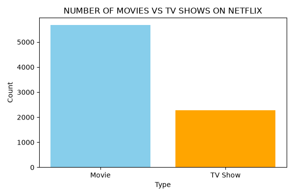
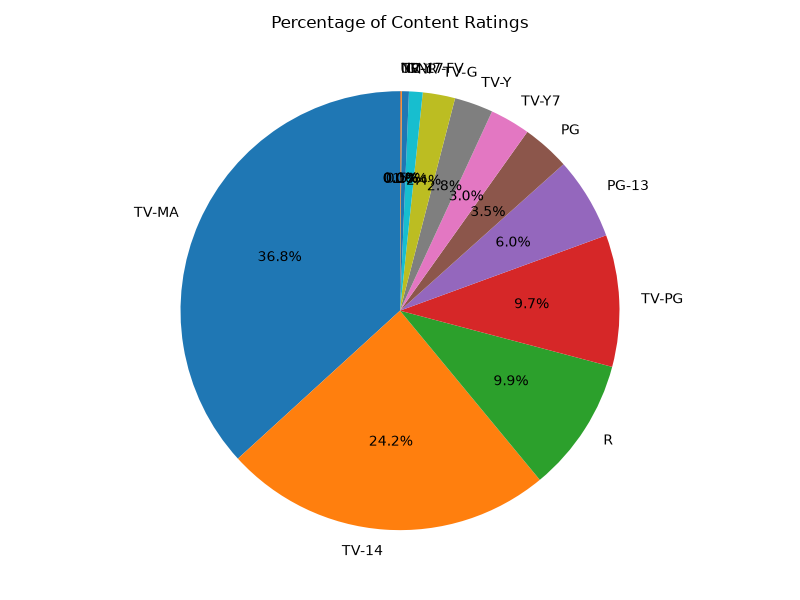
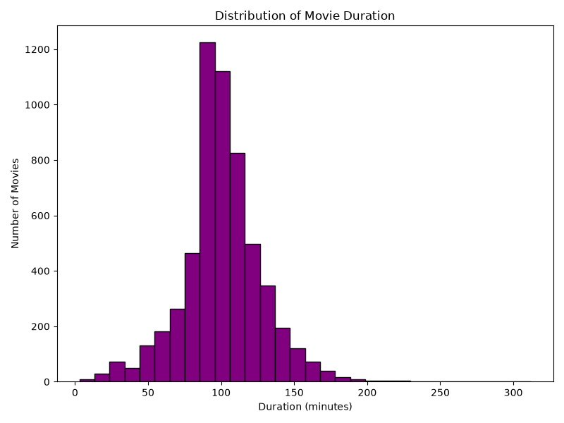
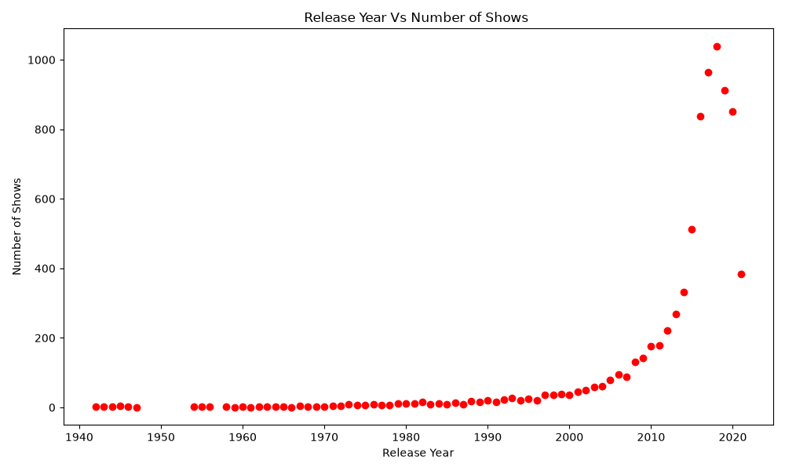
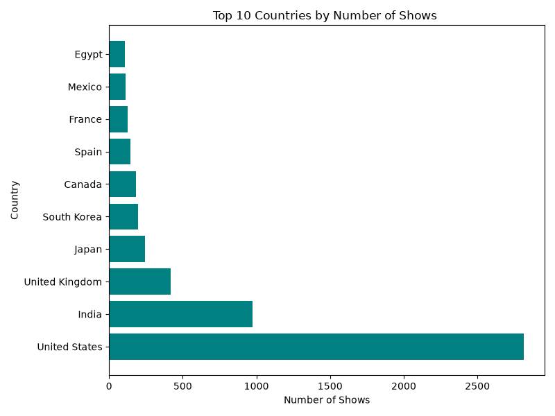
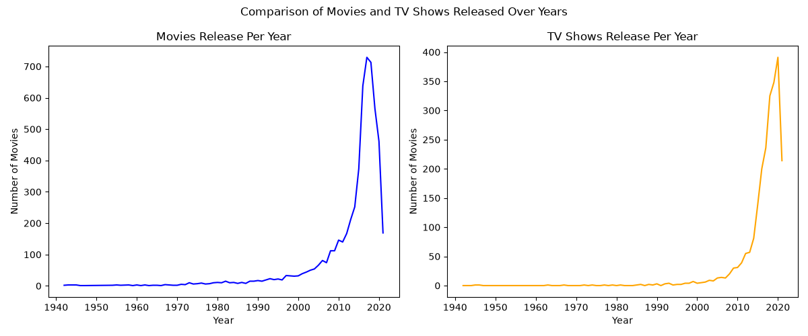

# Netflix Content Analysis & Data Visualization

## 📌 Project Overview

This project analyzes the Netflix titles dataset using Python to explore
movies and TV shows and identify useful patterns and trends.

## 🎯 Objectives

- Analyze Movies vs TV Shows
- Analyze content ratings
- Analyze movie duration
- Study release trends over the years
- Identify the top 10 countries by number of shows
- Compare Movies and TV Shows released over the years

## 🛠️ Technologies Used

- Python
- Pandas
- NumPy
- Matplotlib
- Seaborn
- Jupyter Notebook

## 📊 Analysis Performed

### 1. Movies vs TV Shows

Analyzed the number of Movies and TV Shows available on Netflix.

### 2. Content Ratings

Analyzed the percentage distribution of content ratings.

### 3. Movie Duration

Analyzed the distribution of movie durations in minutes.

### 4. Release Year Analysis

Studied the number of Netflix titles released over different years.

### 5. Top 10 Countries

Identified the top countries based on the number of Netflix titles.

### 6. Movies vs TV Shows Over Time

Compared the release trends of Movies and TV Shows over the years.

## 📈 Key Insights

- Movies are more numerous than TV Shows in the analyzed dataset.
- TV-MA and TV-14 are major content ratings.
- Most movie durations are concentrated around the 80–120 minute range.
- Netflix content additions increased significantly in recent years.
- The United States has the highest number of titles among the top countries analyzed.

## 📂 Project Files

- `netflix_analysis.ipynb` — Python analysis notebook
- `Netflix_titles.csv` — Dataset
- `Content_Ratings_pie.png` — Content ratings visualization
- `movie_duration_histogram.png` — Movie duration visualization
- `Movies_tv_show_comparison.png` — Movies vs TV Shows comparison
- `movies_vs_tvshows.png` — Movies vs TV Shows visualization
- `release_year_Scatter.png` — Release year trend visualization
- `top10_countries.png` — Top 10 countries visualization

## 🚀 How to Run

### 1. Clone the Repository

```bash
git clone https://github.com/rohitgayke01/netflix-content-analysis.git
cd netflix-content-analysis
```

### 2. Install Required Libraries

```bash
pip install pandas numpy matplotlib seaborn jupyter
```

### 3. Start Jupyter Notebook

```bash
jupyter notebook
```

### 4. Open the Notebook

Open `netflix_analysis.ipynb`.

Make sure `Netflix_titles.csv` is in the same folder as the notebook.

## 📊 Visualizations

### 1. Movies vs TV Shows



### 2. Content Ratings



### 3. Movie Duration Distribution



### 4. Release Year Trend



### 5. Top 10 Countries



### 6. Movies vs TV Shows Comparison



## 📝 Conclusion

This project demonstrates how Python can be used for data cleaning,
exploration, analysis, and visualization.

The analysis provides useful insights into Netflix content, including
content types, ratings, movie durations, release trends, and
country-wise distribution.
